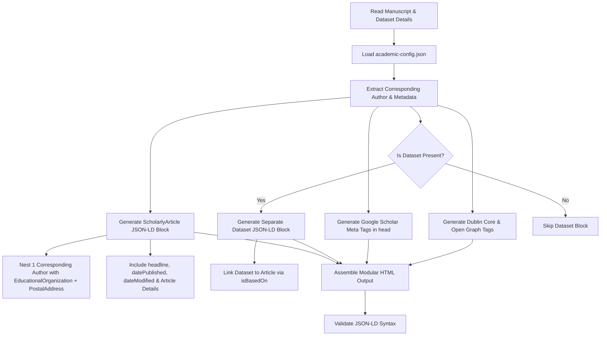

# Academic Article & Dataset Schema Generation

**Version:** 1.0.0  
**Date Published:** 2026-08-14  
**Author:** Mohammad Hafiz bin Ismail ([mypapit@gmail.com](mailto:mypapit@gmail.com) | [https://mypapit.net](https://mypapit.net))  
**License:** MIT

Generates a modular, multi-layer metadata architecture to maximize the indexing, citation capture, open-data discoverability, and semantic comprehension of academic works by **Google Scholar**, **Google Dataset Search**, **Google Search**, **Academic Reference Managers (Zotero, Mendeley, EndNote)**, **Social Crawlers**, and **AI Answer Engines (Perplexity, ChatGPT Search, Gemini, Claude, Semantic Scholar)**.

---

## Install and Invoke This Skill

### ChatGPT Desktop / Codex App

Install the complete repository so the skill can use `academic-config.json`, `references/`, and `examples/`.

For a project-scoped installation, clone it into the project's `.agents/skills/` directory:

```bash
mkdir -p .agents/skills
git clone https://github.com/mypapit/academic-article-schema.git .agents/skills/academic-article-schema
```

For a personal installation available across projects, clone it into `$HOME/.agents/skills/academic-article-schema` (Windows PowerShell: `$HOME\.agents\skills\academic-article-schema`). Codex detects skill changes automatically; restart the app if the skill does not appear.

In the ChatGPT desktop app, open **Skills** in the sidebar and select `academic-article-schema`, or type `@academic-article-schema` in Chat. In Codex CLI or the IDE extension, invoke it explicitly with `$academic-article-schema`, followed by a manuscript file, URL, or pasted metadata. Codex may also select it automatically when the request matches the frontmatter `description`.

See the official [ChatGPT and Codex skills documentation](https://developers.openai.com/codex/skills).

### Open WebUI

1. Open **Workspace > Skills**, click **Import**, and select this `SKILL.md` file.
2. Use it for one message by typing `$academic-article-schema`, or enable it for the whole chat from **+ > Skills**.
3. To make it available to a reusable model preset, open **Workspace > Models**, edit the model, select this skill under **Skills**, and save.
4. When binding the skill to a model, enable native function calling so the model can load the full instructions through `view_skill`. If native function calling is unavailable, use a `$` mention or the per-chat Skills toggle to inject the full instructions.

`SKILL.md` contains the operational workflow. Add `academic-config.json`, `references/`, and `examples/` separately as model knowledge when the model needs those repository resources. See the official [Open WebUI Skills documentation](https://docs.openwebui.com/features/workspace/skills/).

Example invocation:

```text
$academic-article-schema Generate complete Google Scholar meta tags and separate
ScholarlyArticle and Dataset JSON-LD for the attached manuscript.
```

---

## Modular Metadata Architecture

Rather than combining multiple heterogeneous entities into a single unified `@graph`, the architecture uses **modular, cleanly separated JSON-LD blocks** and standard HTML meta tags:

1. **HTML `<head>` Meta Tags**:
   - **Google Scholar / Highwire Press (`citation_*`)**: Required by Google Scholar's crawler to parse bibliographic metadata, authors, and PDF full-text locations.
   - **Dublin Core (`DC.*` / `DCTERMS.*`)**: Consumed by digital libraries, institutional repositories, OAI-PMH harvesters, and reference managers (Zotero, Mendeley).
   - **Open Graph & Twitter Cards (`og:*`, `article:*`, `twitter:*`)**: Used by web scrapers, link preview engines, and social platforms.

2. **Primary JSON-LD: `ScholarlyArticle`**:
   - Dedicated standalone JSON-LD block.
   - Features **one corresponding author** with direct nested **`EducationalOrganization`** affiliation and **`PostalAddress`**.
   - Essential Google requirements: **`headline`**, **`datePublished`**, and **`dateModified`** are strictly included.
   - Links to associated datasets via `"subjectOf"` or `"isBasedOn"`.

3. **Secondary JSON-LD: `Dataset` (Separate Script Block)**:
   - Dedicated standalone JSON-LD block for Google Dataset Search.
   - Contains dataset title, description, identifier (DOI/accession), download distributions (`DataDownload`), open data license, and **links back to the article via `"isBasedOn"`**.

4. **Optional Standalone Blocks**:
   - `BreadcrumbList` (navigation hierarchy) or `FAQPage` (strictly only when visible Q&A exists).

---

## User Configuration (`academic-config.json`)

The skill reads a local configuration file named [`academic-config.json`](file:///c:/xampp74/htdocs/academic-article/academic-article-schema/academic-config.json) (or frontmatter / user prompt parameters) to automatically populate corresponding author details and affiliation addresses:

```json
{
  "correspondingAuthor": {
    "name": "Jane Elizabeth Doe",
    "givenName": "Jane",
    "familyName": "Doe",
    "jobTitle": "Associate Professor of Computational Biology",
    "identifier": "https://orcid.org/0000-0001-5234-9876",
    "email": "jdoe@stanford.edu",
    "sameAs": [
      "https://orcid.org/0000-0001-5234-9876",
      "https://scholar.google.com/citations?user=AbCdEfGAAAAJ",
      "https://www.researchgate.net/profile/Jane-Doe"
    ],
    "affiliation": {
      "@type": "EducationalOrganization",
      "name": "Stanford University",
      "department": "Department of Biomedical Informatics",
      "url": "https://stanford.edu",
      "sameAs": "https://ror.org/00f54p054",
      "address": {
        "@type": "PostalAddress",
        "streetAddress": "450 Jane Stanford Way",
        "addressLocality": "Stanford",
        "addressRegion": "CA",
        "postalCode": "94305",
        "addressCountry": "US"
      }
    }
  },
  "defaultPublisher": {
    "@type": "Organization",
    "name": "Oxford University Press",
    "url": "https://academic.oup.com",
    "sameAs": "https://www.wikidata.org/wiki/Q217595"
  }
}
```

> [!TIP]
> **Affiliation & PostalAddress Best Practice:**
> In academic schema, `EducationalOrganization` is nested directly inside the corresponding author's `affiliation`. It is highly recommended to include a `PostalAddress` with `addressLocality`, `addressRegion` (state/province), `postalCode`, and `addressCountry`. If street-level detail is unavailable, providing the locality, region, and country is sufficient.

---

## Step-by-Step Generation Workflow



---

### Step 1: Ingest & Extract Scholarly Metadata

Extract the following fields from the manuscript or input source:

| Field Category | Key Extraction Points |
| :--- | :--- |
| **Title** | Full formal title of the article (`headline`), subtitle / alternative title |
| **Corresponding Author** | Full name, given name, family name, ORCID iD, email, job title |
| **Affiliation & Postal Address** | `EducationalOrganization` name, department, ROR ID, `PostalAddress` (`streetAddress`, `addressLocality`, `addressRegion`, `postalCode`, `addressCountry`) |
| **Publication Dates** | Print publication date, online publication date, revision date (ISO 8601 `YYYY-MM-DD` and Scholar `YYYY/MM/DD`) |
| **Abstract** | Complete author-written abstract (must be visible on the page without required login) |
| **Identifiers** | DOI (e.g., `10.1093/...`), PMID, arXiv ID, ISSN / ISBN |
| **Publication Venue** | Journal name, volume number, issue number, page numbers (`pageStart`, `pageEnd`) |
| **Full-Text Assets** | Absolute direct URL to crawlable PDF file (`citation_pdf_url`, ending in `.pdf`), HTML URL |
| **Keywords & Topics** | Author keywords, MeSH terms, or Wikidata concepts |
| **Funding & Grants** | Funding agency name, grant number, award URL |
| **Associated Dataset** | Dataset name, description, DOI / URL, repository name, download links (`DataDownload`), license |

---

### Step 2: Generate Google Scholar Meta Tags

Follow the official [Google Scholar Inclusion Guidelines](https://scholar.google.com/intl/en/scholar/inclusion.html#indexing):

```html
<!-- Google Scholar / Highwire Press Meta Tags -->
<meta name="citation_title" content="A Deep Learning Approach for High-Throughput Genomic Variant Annotation">
<meta name="citation_author" content="Smith, John Alexander">
<meta name="citation_author_institution" content="Department of Computational Biology, Stanford University, Stanford, CA, 94305, USA">
<meta name="citation_author_orcid" content="https://orcid.org/0000-0002-1825-0097">
<meta name="citation_author_email" content="jsmith@stanford.edu">
<meta name="citation_publication_date" content="2026/04/15">
<meta name="citation_online_date" content="2026/03/10">
<meta name="citation_journal_title" content="Journal of Computational Genomics">
<meta name="citation_volume" content="42">
<meta name="citation_issue" content="3">
<meta name="citation_firstpage" content="301">
<meta name="citation_lastpage" content="318">
<meta name="citation_doi" content="10.1093/jcg/2026.04.301">
<meta name="citation_issn" content="2045-2322">
<meta name="citation_publisher" content="Oxford University Press">
<meta name="citation_pdf_url" content="https://example.org/articles/2026/genomic-variant-annotation.pdf">
<meta name="citation_abstract_html_url" content="https://example.org/articles/2026/genomic-variant-annotation">
<meta name="citation_keywords" content="deep learning; genomics; variant effect prediction; bioinformatics">
```

---

### Step 3: Generate Dublin Core & Open Graph Meta Tags

```html
<!-- Dublin Core Metadata (DCMI) -->
<meta name="DC.title" content="A Deep Learning Approach for High-Throughput Genomic Variant Annotation">
<meta name="DC.creator" content="Smith, John Alexander">
<meta name="DC.issued" scheme="W3CDTF" content="2026-04-15">
<meta name="DC.date.modified" scheme="W3CDTF" content="2026-04-20">
<meta name="DC.description.abstract" xml:lang="en" content="We introduce a novel deep learning framework that accurately predicts the functional consequences of non-coding genetic variants across diverse human tissues...">
<meta name="DC.publisher" content="Oxford University Press">
<meta name="DC.identifier.doi" content="10.1093/jcg/2026.04.301">
<meta name="DC.identifier.issn" content="2045-2322">
<meta name="DC.relation.ispartof" content="Journal of Computational Genomics, Vol. 42, No. 3, pp. 301-318">
<meta name="DC.type" content="ScholarlyArticle">
<meta name="DC.format" content="application/pdf">
<meta name="DC.rights" content="https://creativecommons.org/licenses/by/4.0/">

<!-- Open Graph & Twitter Cards -->
<meta property="og:type" content="article">
<meta property="og:title" content="A Deep Learning Approach for High-Throughput Genomic Variant Annotation">
<meta property="og:description" content="A novel deep learning framework predicting functional consequences of non-coding genetic variants across diverse human tissues.">
<meta property="og:url" content="https://example.org/articles/2026/genomic-variant-annotation">
<meta property="og:site_name" content="Journal of Computational Genomics">
<meta property="og:image" content="https://example.org/articles/2026/genomic-variant-annotation-graphical-abstract.png">
<meta property="article:published_time" content="2026-04-15T08:00:00Z">
<meta property="article:modified_time" content="2026-04-20T10:30:00Z">
<meta property="article:author" content="John Alexander Smith">
<meta name="twitter:card" content="summary_large_image">
<meta name="twitter:title" content="A Deep Learning Approach for High-Throughput Genomic Variant Annotation">
<meta name="twitter:description" content="A novel deep learning framework predicting functional consequences of non-coding genetic variants across diverse human tissues.">
<meta name="twitter:image" content="https://example.org/articles/2026/genomic-variant-annotation-graphical-abstract.png">
```

---

### Step 4: Generate Primary `ScholarlyArticle` JSON-LD

> [!IMPORTANT]
> **Key Structure Requirements:**
> - Standalone JSON-LD object with `"@type": "ScholarlyArticle"`.
> - **Must include** `headline`, `datePublished`, and `dateModified`.
> - Feature **only one corresponding author** under `"author"`.
> - The author's `"affiliation"` is an **`EducationalOrganization`** (or `Organization`) with an optional/recommended **`PostalAddress`**.
> - References the dataset via `"subjectOf"` or `"isBasedOn"`.

```json
{
  "@context": "https://schema.org",
  "@type": "ScholarlyArticle",
  "@id": "https://example.org/articles/2026/genomic-variant-annotation#article",
  "headline": "A Deep Learning Approach for High-Throughput Genomic Variant Annotation",
  "name": "A Deep Learning Approach for High-Throughput Genomic Variant Annotation",
  "description": "A novel deep learning framework predicting functional consequences of non-coding genetic variants across diverse human tissues.",
  "abstract": "We introduce a novel deep learning framework that accurately predicts the functional consequences of non-coding genetic variants across diverse human tissues. By integrating multi-modal epigenomic profiles, 3D chromatin conformation maps, and evolutionary conservation metrics, our model identifies deleterious regulatory mutations with high sensitivity and specificity. Validated against CRISPR perturbation screens and clinical benchmarks, this computational framework accelerates functional prioritization for genome-wide association studies (GWAS) and rare disease diagnostics.",
  "datePublished": "2026-04-15T08:00:00Z",
  "dateModified": "2026-04-20T10:30:00Z",
  "inLanguage": "en",
  "isAccessibleForFree": true,
  "license": "https://creativecommons.org/licenses/by/4.0/",
  "pageStart": "301",
  "pageEnd": "318",
  "pagination": "301-318",
  "mainEntityOfPage": {
    "@type": "WebPage",
    "@id": "https://example.org/articles/2026/genomic-variant-annotation"
  },
  "author": {
    "@type": "Person",
    "name": "John Alexander Smith",
    "givenName": "John",
    "familyName": "Smith",
    "jobTitle": "Associate Professor of Computational Biology",
    "identifier": "https://orcid.org/0000-0002-1825-0097",
    "email": "mailto:jsmith@stanford.edu",
    "sameAs": [
      "https://orcid.org/0000-0002-1825-0097",
      "https://scholar.google.com/citations?user=AbCdEfGAAAAJ"
    ],
    "affiliation": {
      "@type": "EducationalOrganization",
      "name": "Stanford University",
      "department": "Department of Computational Biology",
      "url": "https://stanford.edu",
      "sameAs": "https://ror.org/00f54p054",
      "address": {
        "@type": "PostalAddress",
        "streetAddress": "450 Jane Stanford Way",
        "addressLocality": "Stanford",
        "addressRegion": "CA",
        "postalCode": "94305",
        "addressCountry": "US"
      }
    }
  },
  "publisher": {
    "@type": "Organization",
    "name": "Oxford University Press",
    "url": "https://academic.oup.com",
    "sameAs": "https://www.wikidata.org/wiki/Q217595"
  },
  "isPartOf": {
    "@type": "PublicationIssue",
    "issueNumber": "3",
    "datePublished": "2026-04-15",
    "isPartOf": {
      "@type": "PublicationVolume",
      "volumeNumber": "42",
      "isPartOf": {
        "@type": "AcademicJournal",
        "name": "Journal of Computational Genomics",
        "issn": "2045-2322"
      }
    }
  },
  "image": {
    "@type": "ImageObject",
    "url": "https://example.org/articles/2026/genomic-variant-annotation-graphical-abstract.png",
    "width": 1200,
    "height": 630,
    "caption": "Graphical Abstract: Neural network architecture for variant effect prediction."
  },
  "subjectOf": {
    "@type": "Dataset",
    "name": "High-Throughput Functional Predictions for Non-Coding Variants (GRCh38)",
    "url": "https://doi.org/10.5281/zenodo.1234567",
    "identifier": "10.5281/zenodo.1234567"
  },
  "encoding": [
    {
      "@type": "MediaObject",
      "encodingFormat": "application/pdf",
      "contentUrl": "https://example.org/articles/2026/genomic-variant-annotation.pdf"
    }
  ],
  "identifier": [
    {
      "@type": "PropertyValue",
      "propertyID": "doi",
      "value": "10.1093/jcg/2026.04.301"
    }
  ],
  "sameAs": [
    "https://doi.org/10.1093/jcg/2026.04.301",
    "https://arxiv.org/abs/2603.12345"
  ],
  "keywords": [
    "Deep Learning",
    "Genomics",
    "Variant Effect Prediction",
    "CRISPR Benchmark"
  ],
  "about": [
    {
      "@type": "DefinedTerm",
      "name": "Genomics",
      "sameAs": "https://www.wikidata.org/wiki/Q222010"
    }
  ],
  "funding": [
    {
      "@type": "MonetaryGrant",
      "name": "National Human Genome Research Institute Award",
      "identifier": "R01HG012345",
      "funder": {
        "@type": "Organization",
        "name": "National Institutes of Health",
        "sameAs": "https://ror.org/01cwqze88"
      }
    }
  ]
}
```

---

### Step 5: Generate Separate `Dataset` JSON-LD

When the article has an associated open dataset, output a **separate, distinct `<script type="application/ld+json">`** formatted for **Google Dataset Search**:

```json
{
  "@context": "https://schema.org",
  "@type": "Dataset",
  "@id": "https://doi.org/10.5281/zenodo.1234567#dataset",
  "name": "High-Throughput Functional Predictions and Benchmarks for Non-Coding Human Genetic Variants (GRCh38)",
  "description": "Precomputed functional variant effect scores, whole-genome chromatin accessibility features, and CRISPR validation benchmarks for 1.2 billion non-coding variants in human genome build GRCh38.",
  "url": "https://zenodo.org/records/1234567",
  "sameAs": "https://doi.org/10.5281/zenodo.1234567",
  "identifier": [
    {
      "@type": "PropertyValue",
      "propertyID": "doi",
      "value": "10.5281/zenodo.1234567"
    }
  ],
  "license": "https://creativecommons.org/publicdomain/zero/1.0/",
  "isAccessibleForFree": true,
  "creator": {
    "@type": "Person",
    "name": "John Alexander Smith",
    "identifier": "https://orcid.org/0000-0002-1825-0097",
    "affiliation": {
      "@type": "EducationalOrganization",
      "name": "Stanford University",
      "address": {
        "@type": "PostalAddress",
        "addressLocality": "Stanford",
        "addressRegion": "CA",
        "postalCode": "94305",
        "addressCountry": "US"
      }
    }
  },
  "isBasedOn": {
    "@type": "ScholarlyArticle",
    "name": "A Deep Learning Approach for High-Throughput Genomic Variant Annotation",
    "url": "https://example.org/articles/2026/genomic-variant-annotation",
    "identifier": "10.1093/jcg/2026.04.301"
  },
  "includedInDataCatalog": {
    "@type": "DataCatalog",
    "name": "Zenodo",
    "url": "https://zenodo.org"
  },
  "keywords": [
    "Genomics dataset",
    "GRCh38",
    "Variant Effect Scores",
    "CRISPR Benchmark"
  ],
  "variableMeasured": "Deleteriousness probability score of non-coding SNVs",
  "distribution": [
    {
      "@type": "DataDownload",
      "encodingFormat": "application/gzip",
      "contentUrl": "https://zenodo.org/records/1234567/files/variant_scores_grch38.tsv.gz",
      "contentSize": "4.2 GB"
    },
    {
      "@type": "DataDownload",
      "encodingFormat": "application/x-hdf5",
      "contentUrl": "https://zenodo.org/records/1234567/files/embeddings_grch38.h5",
      "contentSize": "12.8 GB"
    }
  ]
}
```

---

### Step 6: Conditional FAQPage Schema (Use Only When Needed)

> [!CAUTION]
> Only emit `FAQPage` if the web page features an explicit, visible reader-facing supplementary Q&A or FAQ section.

```html
<script type="application/ld+json">
{
  "@context": "https://schema.org",
  "@type": "FAQPage",
  "mainEntity": [
    {
      "@type": "Question",
      "name": "Where can researchers download the trained model weights and benchmark datasets?",
      "acceptedAnswer": {
        "@type": "Answer",
        "text": "Trained PyTorch weights, precomputed variant effect scores for GRCh38, and evaluation code are freely available on GitHub and archived on Zenodo under DOI 10.5281/zenodo.1234567."
      }
    }
  ]
}
</script>
```

---

## Validation & Verification Checklist

- [ ] **Google Scholar Compliance**:
  - `citation_title` matches the paper's title exactly.
  - `citation_author` contains the corresponding author name.
  - `citation_publication_date` is formatted as `YYYY/MM/DD`, `YYYY/MM`, or `YYYY`.
  - `citation_pdf_url` is an absolute URL ending with `.pdf`.
- [ ] **ScholarlyArticle Structure**:
  - `headline`, `datePublished`, and `dateModified` are all present.
  - Features exactly **one corresponding author** under `author`.
  - Author `affiliation` is an `EducationalOrganization` (or `Organization`) containing structured `PostalAddress` (`streetAddress`, `addressLocality`, `addressRegion`, `postalCode`, `addressCountry`).
- [ ] **Separate Dataset Structure (if applicable)**:
  - Output as an independent `<script type="application/ld+json">` block.
  - Contains `name`, `description` (>50 chars), `license`, `distribution`, and `isBasedOn` linking back to the article.
- [ ] **Script Injection & HTML Security**:
  - Escape closing script tags: replace `</` with `<\/` and `<` with `\u003c`.
